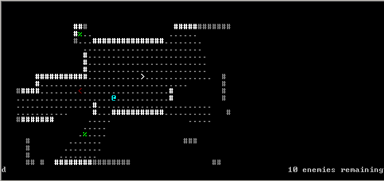

Haskell Roguelike
===

This is the beginning of a roguelike programmed in Haskell.  It is intended as a challeng/learning exercise, and will likely be perpetually incomplete.

TODO:
- [x] Movement of the player character
- [x] Line-of-sight calculation and indication on the level map
- [x] Automatic generation of random level maps
- [ ] Player statistics; e.g. health
- [ ] Non-player characters
- [ ] Battle
- [ ] Items

